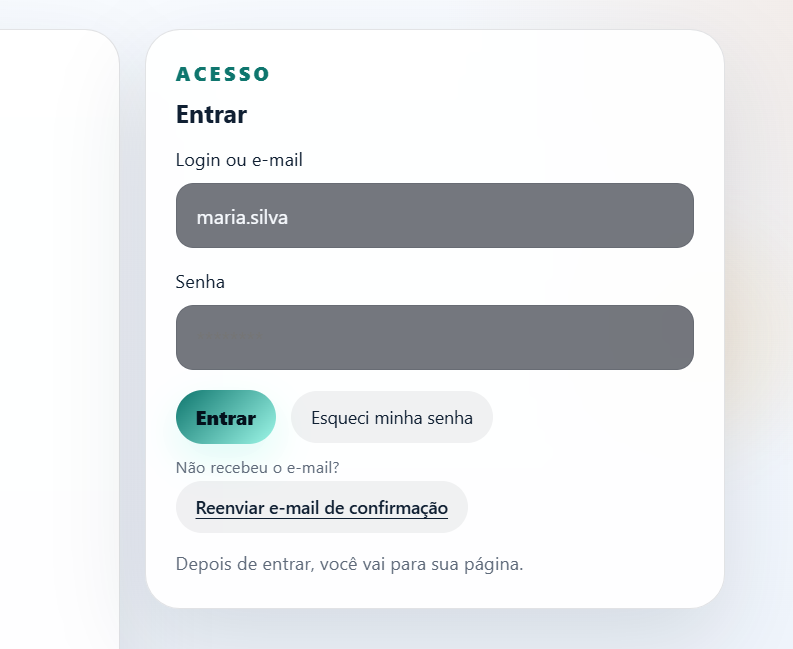
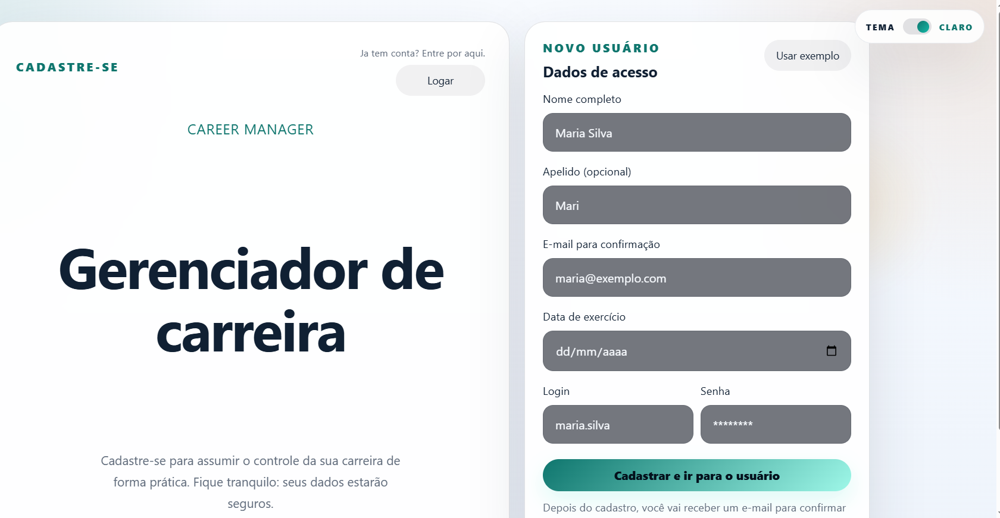
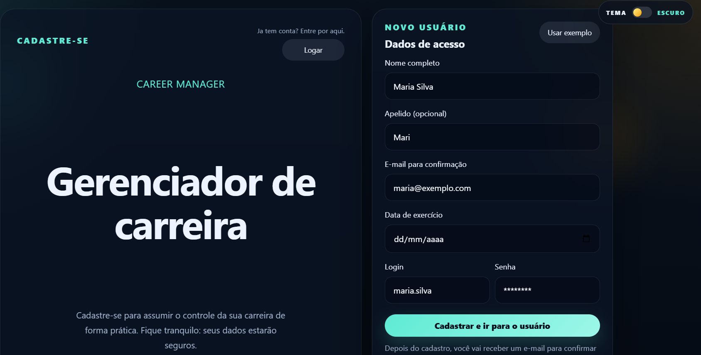
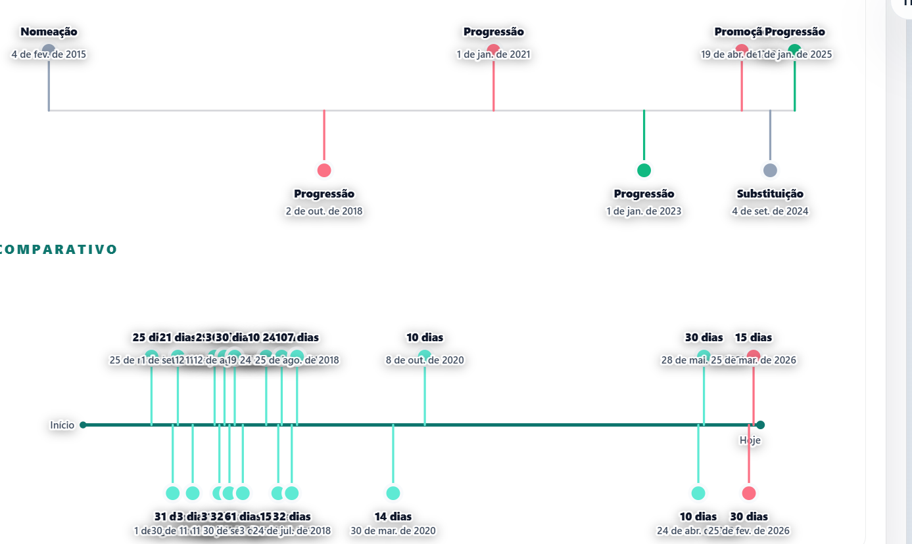
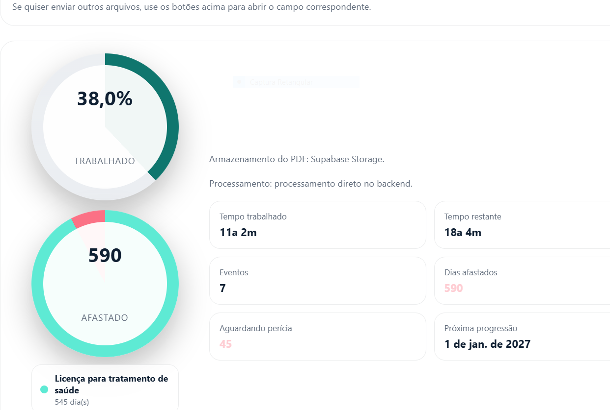

> This README is available in two versions: English first, then Portuguese.

# Career Management

Web platform for user signup, authentication, email confirmation, and career history analysis.
The project combines FastAPI, Next.js, PostgreSQL, Redis, and an architecture prepared for
queues and asynchronous PDF processing.

## Overview

The system helps users visualize their professional journey with:

- user signup with email confirmation
- authenticated login
- password recovery by email
- user profile page
- PDF upload and analysis for career history
- optional PDF upload for leave records
- queue-based processing for heavy PDF tasks
- charts for worked time, remaining time, and absences
- timeline of career events
- light and dark theme toggle

## Structure

- `backend/`: Python FastAPI API
- `frontend/`: Next.js application
- `backend/queue/`: queues, jobs, and worker
- `observability/`: local observability stack
- `run-backend.cmd`: starts the backend
- `run-frontend.cmd`: starts the frontend
- `run-observability.cmd`: starts the metrics and dashboards stack

## Run Locally

### Backend

```powershell
.\run-backend.cmd
```

### Frontend

```powershell
.\run-frontend.cmd
```

### Full Stack with Docker

```powershell
docker compose up --build
```

Run in detached mode:

```powershell
docker compose up --build -d
```

Stop everything:

```powershell
docker compose down
```

## Configuration

- `backend/.env`: backend variables
- `frontend/.env.local`: public API URL used by the frontend
- `backend/.env.example`: sample backend configuration
- `frontend/.env.local.example`: sample frontend configuration

### Important Variables

- `DATABASE_URL`
- `REDIS_URL`
- `SUPABASE_URL`
- `SUPABASE_SERVICE_ROLE_KEY`
- `SUPABASE_STORAGE_BUCKET`
- `SUPABASE_STORAGE_HISTORICO_PREFIX`
- `SUPABASE_STORAGE_AFASTAMENTOS_PREFIX`
- `CORS_ORIGINS`
- `FRONTEND_BASE_URL`
- `SMTP_HOST`
- `SMTP_PORT`
- `SMTP_USER`
- `SMTP_PASSWORD`
- `SMTP_FROM_EMAIL`
- `SMTP_FROM_NAME`
- `SMTP_USE_TLS`
- `SMTP_USE_SSL`
- `SMTP_TIMEOUT`
- `EMAIL_PROVIDER`
- `RESEND_API_KEY`
- `RESEND_FROM_EMAIL`
- `AUTO_SYNC_DB_SCHEMA`
- `NEXT_PUBLIC_API_URL`

For production emails, prefer `EMAIL_PROVIDER=resend` with a verified sender.

If `DATABASE_URL` points to Supabase, the backend automatically adds `sslmode=require` when it
detects a `*.supabase.co` host.

## Backend

The backend is responsible for:

- signup and login
- email confirmation and resend flows
- password recovery and reset
- user profile
- career history reading
- leave record processing
- observability metrics

### Deploy Entry

Use the FastAPI app entrypoint:

```bash
backend.app:app
```

### Authentication Flow

Confirmation, resend, and recovery emails are sent with `BackgroundTasks` right after the main
response is prepared. This keeps authentication independent from Redis.

### PDF Queue

Heavy tasks use Redis + RQ:

- career history PDF reading
- leave record PDF reading

When `REDIS_URL` is available, the API schedules the task and the frontend can poll:

`GET /api/historicos-funcionais/jobs/{job_id}`

If the queue is unavailable, the backend can still process directly for local development.

### PDF Storage

PDFs are stored in Supabase Storage:

- bucket: `gestaocarreira`
- career history folder: `historicofuncional`
- leave folder: `afastamentos`

The database stores only file paths and analysis metadata.

If Supabase Storage is unavailable, the backend falls back to a local directory
(`backend/storage_data`) and marks the response with `armazenamento_origem: "local"`.

## Frontend

The frontend is a Next.js app that consumes the public API configured in `NEXT_PUBLIC_API_URL`.

### Main Structure

- `frontend/app/`: App Router routes
- `frontend/features/`: domain modules
- `frontend/shared/`: shared utilities

### Important Note

Frontend requests go directly to the backend configured in `NEXT_PUBLIC_API_URL`.
There is no built-in default URL in the code. Locally, use `frontend/.env.local`; in production,
set the variable in the deployment environment.

The backend must allow the frontend origin through `CORS_ORIGINS`.

## Database and Cache

The database was tuned to improve the most common queries:

- authentication by login, email, and token
- fetching the latest career history
- loading the dashboard without a full table scan

Redis is also used as a short-lived read cache for:

- latest user
- latest career history

Cache keys use a short TTL and are invalidated automatically when the database changes.

## Docker

The project images are split by service:

- backend: [Dockerfile](Dockerfile)
- frontend: [frontend/Dockerfile](frontend/Dockerfile)

These images are for application deployment. The `Dockerfile` packages only the app; the database
and Redis run as external or managed services.

### Useful Commands

Backend build:

```powershell
docker build -t gestao-carreira-backend .
```

Backend run:

```powershell
docker run --rm -p 8000:8000 --env-file backend/.env gestao-carreira-backend
```

Frontend build:

```powershell
docker build -t gestao-carreira-frontend --build-arg NEXT_PUBLIC_API_URL=https://seu-backend.com -f frontend/Dockerfile frontend
```

Frontend run:

```powershell
docker run --rm -p 3000:3000 -e PORT=3000 gestao-carreira-frontend
```

## Main Flow

1. The user creates an account.
2. The backend saves the data and schedules the confirmation email.
3. The user confirms the account and logs in.
4. The user page shows the profile and career history.
5. Career history and leave records are read from PDF and converted into visual summaries.
6. When Redis is available, these PDFs go to the queue and the frontend tracks the status.

## Stack

- Python 3.11+
- FastAPI
- SQLAlchemy
- PostgreSQL
- Redis + RQ
- Next.js
- React
- TypeScript

## Observability

The backend exposes metrics at `GET /api/metrics` in Prometheus format.

To start the local collection and dashboard stack:

```powershell
.\run-observability.cmd
```

This starts:

- Prometheus at `http://localhost:9090`
- Grafana at `http://localhost:3001`

More details in [observability/README.md](observability/README.md).

## Demo

Live frontend:

- [https://gestaodecarreira.vercel.app/](https://gestaodecarreira.vercel.app/)

## Screenshots

### Login



### Signup in light theme



### Signup in dark theme



### Charts and functional summary



### Career history



## Recent Update

- login still goes directly to the backend, without a queue
- signup sends the confirmation email in background right after saving the user
- the login screen includes a subtle option to resend the confirmation email
- Redis/RQ is now used only for heavy PDF processing

---

# Gestão de Carreira

Plataforma web para cadastro, autenticação, confirmação por e-mail e análise de histórico funcional.
O projeto combina FastAPI, Next.js, PostgreSQL, Redis e uma arquitetura preparada para filas e
processamento assíncrono de PDFs.

## Visão Geral

O sistema ajuda a visualizar a trajetória profissional com:

- cadastro de usuário com confirmação por e-mail
- login autenticado
- recuperação de senha por e-mail
- página de perfil do usuário
- envio e leitura de histórico funcional em PDF
- envio opcional de afastamentos em PDF
- fila para processamento pesado de PDFs
- gráficos de tempo trabalhado, tempo restante e afastamentos
- linha do tempo dos eventos da carreira
- alternância entre tema claro e escuro

## Estrutura

- `backend/`: API FastAPI em Python
- `frontend/`: aplicação Next.js
- `backend/queue/`: filas, jobs e worker
- `observability/`: stack de observabilidade local
- `run-backend.cmd`: inicia o backend
- `run-frontend.cmd`: inicia o frontend
- `run-observability.cmd`: inicia a stack de métricas e dashboards

## Como Rodar Localmente

### Backend

```powershell
.\run-backend.cmd
```

### Frontend

```powershell
.\run-frontend.cmd
```

### Stack Completa com Docker

```powershell
docker compose up --build
```

Em segundo plano:

```powershell
docker compose up --build -d
```

Para parar tudo:

```powershell
docker compose down
```

## Configuração

- `backend/.env`: variáveis do backend
- `frontend/.env.local`: URL pública da API consumida pelo frontend
- `backend/.env.example`: exemplo com SMTP, Redis, Supabase e demais variáveis
- `frontend/.env.local.example`: exemplo da configuração do frontend

### Variáveis Importantes

- `DATABASE_URL`
- `REDIS_URL`
- `SUPABASE_URL`
- `SUPABASE_SERVICE_ROLE_KEY`
- `SUPABASE_STORAGE_BUCKET`
- `SUPABASE_STORAGE_HISTORICO_PREFIX`
- `SUPABASE_STORAGE_AFASTAMENTOS_PREFIX`
- `CORS_ORIGINS`
- `FRONTEND_BASE_URL`
- `SMTP_HOST`
- `SMTP_PORT`
- `SMTP_USER`
- `SMTP_PASSWORD`
- `SMTP_FROM_EMAIL`
- `SMTP_FROM_NAME`
- `SMTP_USE_TLS`
- `SMTP_USE_SSL`
- `SMTP_TIMEOUT`
- `EMAIL_PROVIDER`
- `RESEND_API_KEY`
- `RESEND_FROM_EMAIL`
- `AUTO_SYNC_DB_SCHEMA`
- `NEXT_PUBLIC_API_URL`

Para e-mails em produção, prefira `EMAIL_PROVIDER=resend` com um remetente verificado.

Se o `DATABASE_URL` vier do Supabase, o backend adiciona `sslmode=require` automaticamente quando
detecta um host `*.supabase.co`.

## Backend

O backend é responsável por:

- cadastro e login
- confirmação e reenvio de confirmação por e-mail
- recuperação e redefinição de senha
- perfil do usuário
- leitura de histórico funcional
- processamento de afastamentos
- métricas para observabilidade

### Entrada de Deploy

Use a aplicação FastAPI em:

```bash
backend.app:app
```

### Fluxo de Autenticação

Os e-mails de confirmação, reenvio de confirmação e recuperação de senha são enviados em
`BackgroundTasks` logo depois que a resposta principal é preparada. Isso evita depender de Redis
para o fluxo de autenticação.

### Fila de PDFs

As tarefas mais pesadas usam Redis + RQ:

- leitura do PDF do histórico funcional
- leitura dos afastamentos

Quando `REDIS_URL` estiver configurado, a API agenda a tarefa e o frontend consulta o status em:

`GET /api/historicos-funcionais/jobs/{job_id}`

Se a fila não estiver disponível, o backend faz o processamento de forma direta para manter o
ambiente local funcionando.

### Storage de PDFs

Os PDFs ficam no Supabase Storage:

- bucket: `gestaocarreira`
- pasta de histórico funcional: `historicofuncional`
- pasta de afastamentos: `afastamentos`

O banco guarda apenas o caminho do arquivo e os metadados da análise.

Se o Supabase Storage não estiver acessível, o backend salva o PDF em um diretório local de
fallback (`backend/storage_data`) e marca a resposta com `armazenamento_origem: "local"`.

## Frontend

O frontend é uma aplicação Next.js que consome a API pública informada em `NEXT_PUBLIC_API_URL`.

### Estrutura Principal

- `frontend/app/`: rotas do App Router
- `frontend/features/`: módulos por domínio
- `frontend/shared/`: utilitários compartilhados

### Observação Importante

As chamadas do frontend vão direto para o backend configurado em `NEXT_PUBLIC_API_URL`.
Não há URL padrão embutida no código. Localmente use `frontend/.env.local` e, em produção,
defina a variável no ambiente de deploy.

O backend precisa responder CORS para a origem do frontend por meio de `CORS_ORIGINS`.

## Banco e Cache

O banco foi ajustado para responder melhor nas consultas mais comuns:

- autenticação por login, e-mail e token
- busca do último histórico funcional do usuário
- carregamento do painel sem depender de varredura completa da tabela

O backend também usa Redis como cache de leitura para reduzir consultas repetidas:

- último usuário
- último histórico funcional do usuário

As chaves têm TTL curto e são invalidadas automaticamente quando o banco é alterado, para evitar
respostas desatualizadas.

## Docker

As imagens do projeto ficam separadas por serviço:

- backend: [Dockerfile](Dockerfile)
- frontend: [frontend/Dockerfile](frontend/Dockerfile)

Essas imagens são para deploy da aplicação. O `Dockerfile` empacota só o app; banco e Redis ficam
como serviços externos ou gerenciados pela plataforma.

### Comandos Úteis

Build do backend:

```powershell
docker build -t gestao-carreira-backend .
```

Run do backend:

```powershell
docker run --rm -p 8000:8000 --env-file backend/.env gestao-carreira-backend
```

Build do frontend:

```powershell
docker build -t gestao-carreira-frontend --build-arg NEXT_PUBLIC_API_URL=https://seu-backend.com -f frontend/Dockerfile frontend
```

Run do frontend:

```powershell
docker run --rm -p 3000:3000 -e PORT=3000 gestao-carreira-frontend
```

## Fluxo Principal

1. A pessoa cria a conta.
2. O backend salva os dados e agenda o e-mail de confirmação.
3. A pessoa confirma o cadastro e faz login.
4. A página do usuário mostra o perfil e o histórico funcional.
5. O histórico funcional e os afastamentos são lidos em PDF e convertidos em resumos visuais.
6. Quando o Redis está disponível, esses PDFs entram na fila e o front acompanha o status.

## Stack

- Python 3.11+
- FastAPI
- SQLAlchemy
- PostgreSQL
- Redis + RQ
- Next.js
- React
- TypeScript

## Observabilidade

O backend expõe métricas em `GET /api/metrics` no formato Prometheus.

Para subir a stack local de coleta e visualização:

```powershell
.\run-observability.cmd
```

Isso inicia:

- Prometheus em `http://localhost:9090`
- Grafana em `http://localhost:3001`

Mais detalhes em [observability/README.md](observability/README.md).

## Demo

Frontend publicado:

- [https://gestaodecarreira.vercel.app/](https://gestaodecarreira.vercel.app/)

## Capturas de Tela

### Login


### Cadastro no tema claro


### Cadastro no tema escuro


### Gráficos e resumo funcional


### Histórico funcional


## Atualização Recente

- o login continua direto no backend, sem fila
- o cadastro envia e-mail de confirmação em background logo depois de salvar o usuário
- a tela de login ganhou a opção discreta de reenviar e-mail de confirmação
- a fila Redis/RQ ficou só para o processamento pesado de PDFs
